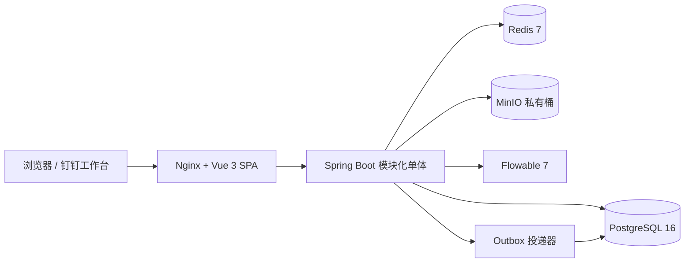

# 律师行业 OA 第五阶段开发与验收报告

报告日期：2026-07-28  
项目目录：`/Users/liuzf/Documents/Zoro_AI/law_firm_oa`  
目标规模：100 人以内律师事务所，低并发，案件合同文件为核心数据资产

## 一、执行结论

本阶段完成“上线准备与法律文档安全强化”的可本地交付部分。系统已从只有办公室范围
隔离，推进到具备正式分所授权后台、临时授权到期、权限变更留痕、下载突发预警、
下载硬限流、安全事件检索和可重复备份恢复演练。

当前结论是：系统适合本地完整验收、试点演示和业务流程确认；在真实钉钉企业应用、
生产密钥、托管数据库 PITR、对象版本恢复和正式域名尚未验收前，不应直接存放真实客户
合同与案件原件。

## 二、本阶段交付

### 1. 分所成员与临时授权

- 新增分所有效成员查询、加入/更新、撤销接口。
- 支持 `MEMBER`、`MANAGER`、主办公室和临时授权到期时间。
- 办公室管理员仅能在自己管理的办公室授予普通成员权限。
- 管理员权限和主办公室调整仅允许全所管理员或管理合伙人执行。
- 主办公室不得设置到期时间，撤销前必须先调整新的主办公室。
- 到期授权从办公室范围、通讯录、公告收件人和成员统计中自动失效。
- 加入、更新、撤销同时进入授权历史和通用操作审计。
- 前端全球办公室页新增中英文成员授权管理区，支持成员、级别、到期时间、主办公室和撤销。

### 2. 文档下载安全

- 下载前继续执行案件/合同成员和 `can_download` 校验。
- 每次下载地址申请记录 IP、User-Agent 和关联 ID。
- 单用户滚动 5 分钟内第 10 次成功下载生成 `MEDIUM` 突发预警。
- 已有 30 次成功下载时拒绝后续请求，返回 HTTP 429 和稳定错误码。
- 被拒请求仍保留 `DENIED` 下载日志与 `HIGH` 安全事件，不因事务异常回滚。
- 管理员可查询安全事件；普通律师访问事件接口返回 403。
- 并发下载按用户数据库行加事务锁，避免同一用户并发请求绕过计数阈值。

### 3. 备份与恢复演练

- `scripts/backup-local.sh`：生成 PostgreSQL custom dump、MinIO 数据包和 SHA-256 清单。
- `scripts/verify-backup.sh`：校验摘要与归档，恢复到名称唯一的隔离数据库，核对核心表，
  最后自动删除临时数据库。
- 本轮实际恢复结果：Flyway 15 条成功迁移、17 个用户、44 份文档、828 条审计记录。
- 备份产物位于 `backups/20260728T074513Z/`，该目录已加入 Git 忽略。

## 三、整体系统梳理

100 人低并发场景继续采用模块化单体是合理的。它减少微服务带来的分布式事务、网络、
部署和运维成本，同时已经按身份、案件、文档、审批、行政 OA、通知等包和数据表保持边界。

| 领域 | 当前能力 | 关键约束 |
|---|---|---|
| 身份与组织 | 钉钉 OAuth 框架、会话、组织快照、多外部身份 | 生产禁用开发身份 |
| 全球办公室 | 12 个办公室、主办公室、成员/经理/全所范围 | 临时授权自动到期 |
| 客户与冲突 | 主体、别名、客户、全所冲突检索 | 冲突信息不按分所隐藏 |
| 案件与合同 | 成员、跨境字段、期限、审批、状态回写 | 显式成员关系可跨办公室 |
| 私有文档 | 直传、版本、SHA-256、下载授权、风控 | 不暴露永久公开 URL |
| 统一审批 | Flowable、待办/已办、转交、催办、幂等 | 流程与业务状态事务一致 |
| 常见 OA | 公告、任务、请假、报销、会议室、通讯录 | RBAC 与 Office Scope 同时生效 |
| 用印与卷宗 | 用印审批、建卷、编目、审计 | 文件访问继承业务权限 |
| 通知与审计 | Outbox、站内信、已读、关联 ID、来源信息 | Outbox 重试与死信边界 |
| 国际化 | 中英文登录、导航、标题、办公室和新增授权界面 | 业务正文仍需继续双语化 |

## 四、数据层变化

生产迁移 `V9__office_membership_and_document_security.sql` 新增：

- `user_offices.valid_until / assigned_by / updated_at`
- `office_membership_history`
- `document_security_events`
- `OFFICE_MEMBER_MANAGE`
- `DOCUMENT_SECURITY_VIEW`
- 授权有效期、历史和安全事件查询索引

V9 已在现有开发数据库成功执行。由于开发种子迁移使用 V100–V105，开发环境开启了
Flyway out-of-order；正式环境仅包含 V1–V9，必须保持严格顺序。

## 五、测试与验证结果

| 验证层 | 结果 |
|---|---:|
| Java 单元/边界测试 | 59/59 |
| Vue 权限策略测试 | 3/3 |
| TypeScript + Vite 生产构建 | 通过 |
| PostgreSQL/Redis/MinIO/Flowable API 验证 | 39/39 |
| Playwright 浏览器场景 | 12 组 |
| 中英文业务页面 | 16 个 |
| 浏览器控制台/页面错误 | 0 |
| Flyway | 15 条成功，V9 已执行 |
| Outbox | 最终 613 条，全部 `PROCESSED` |
| 备份校验与隔离恢复 | 通过 |

新增验收覆盖：

- 临时授权写入与授权后办公室可见。
- 撤销后办公室立即不可见。
- 全所管理员可授予办公室管理员。
- 办公室管理员可以维护普通成员，但不能授予管理员权限。
- 下载突发产生预警，第 31 次地址申请前必然触发 429。
- 安全事件包含当前用户和文档，普通律师不可查询。
- 浏览器完成临时授权、列表展示、撤销及数据清理。

JaCoCo 当前白盒覆盖：

- 指令 1826/15701，11.63%
- 分支 104/759，13.70%
- 行 305/3287，9.28%
- 方法 97/549，17.67%

黑盒 API 和浏览器覆盖不计入 JaCoCo，因此当前整体功能验收较强，但服务层白盒覆盖仍是
明确工程短板。报告位于 `test-results/jacoco-stage5/index.html`。

## 六、当前运行状态

- OA 登录页：`http://localhost:18080/login`
- 后端健康检查：`http://localhost:8081/actuator/health`
- PostgreSQL：`localhost:5433`
- Redis：`localhost:6380`
- MinIO API/控制台：`localhost:9000/9001`
- 前端、后端、PostgreSQL、Redis、MinIO 容器均在运行。

最终验收后数据快照：18 个用户、12 个办公室、55 个案件、1 份合同、46 份文档、
916 条审计记录、15 条办公室授权历史、4 条文档安全事件。

## 七、风险和后续优先级

### P0：生产上线前

1. 使用真实钉钉企业内部应用验证授权回调、会话过期、组织同步、离职停用和权限回收。
2. 在托管 PostgreSQL 完成 PITR 演练，在生产对象存储完成版本恢复和跨账号复制演练。
3. 将数据库、会话、对象存储和钉钉凭证接入密钥管理并完成轮换演练。
4. 配置域名、TLS、WAF、备份失败告警、`HIGH/OPEN` 文档安全事件告警。

### P1：法律文档深化

1. 外发审批、批量导出审批、动态水印和分享链接吊销。
2. 保密等级对应不同下载阈值，敏感卷宗下载增加二次确认或审批。
3. 授权到期提醒、跨办公室权限季度复核和离职自动撤权。
4. 为文档、授权、工作流增加 Testcontainers 成功/失败/并发集成测试。

### P2：业务完善

1. 合同版本可视化比较、电子签章回执和到期归档。
2. 案件工时、账单、回款、客户门户和跨办公室经营报表。
3. 通知、流程名、表单字段、审计动作和业务正文的完整中英文覆盖。

## 八、最终判断

本阶段计划内的分所授权、临时授权、下载安全、真实栈回归和本地恢复演练均已完成，
没有遗留的本地构建或运行错误。系统已经具备小规模试点所需的核心闭环，但生产上线仍
取决于真实钉钉、正式基础设施和密钥/恢复演练，这些不能用本地模拟结果替代。
