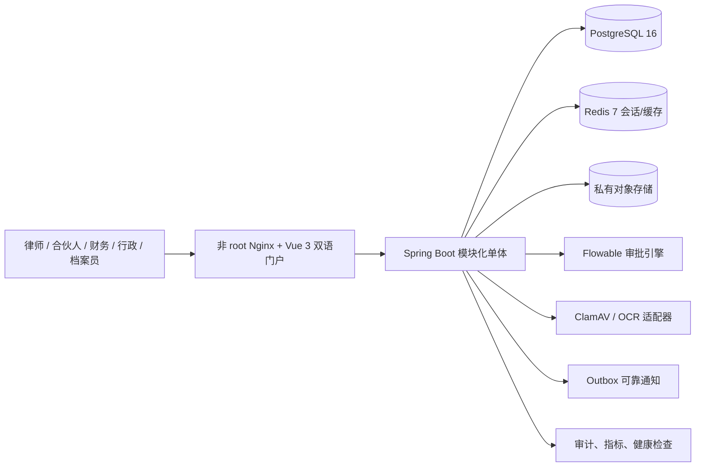

# 律师事务所 OA 最新研发与交付报告

报告日期：2026-07-29
发布候选：`0.3.0-rc.1`  
适用规模：100 人以内律师事务所，中英双语、低并发，以案件、合同和法律文件为核心资产

## 一、执行结论

P0 与 P1 范围内的本地可交付能力已经完成，系统已形成从登录、组织、客户、冲突检索、
案件、合同、期限、文档、审批、卷宗，到工时、账单、回款、行政办公、管理配置和审计
的业务闭环。代码、数据库迁移、容器、自动化测试、安全扫描、100 用户代表性负载、
备份恢复和回滚兼容均已通过最终验收。

当前结论为“商业试点候选版本通过，生产上线有条件放行”。仍需客户提供真实钉钉应用、
正式域名和证书、托管数据库/对象存储、密钥管理以及第三方电子签章、邮件和财务接口，
完成真实环境验收后才能承载正式客户案件原件。

## 二、系统架构

100 人、低并发场景采用模块化单体，避免微服务带来的分布式事务、网络和运维成本。
身份、案件、文档、财务、审批和管理模块在代码及数据表层保持边界；未来如文件处理或
外部集成出现独立扩容需求，可沿现有适配器边界拆分。

## 三、已交付能力

| 领域 | 主要能力 | 核心控制 |
|---|---|---|
| 身份与组织 | 钉钉 OAuth、组织绑定会话、通讯录快照、外部身份映射 | 生产禁用开发身份；跨租户拒绝 |
| 国际化与办公室 | 中英双语、12 个办公室、时区/币种、主办公室、临时访问 | RBAC 与办公室范围双重生效 |
| 客户与冲突 | 关系主档、别名、客户转换、全所冲突检索 | 创建/管理权限分离；编辑保留备注与来源 |
| 案件与合同 | 关联客户/相对方立项、成员、跨境字段、合同、期限、状态流转、统一工作台 | 立项权限与案件写权限分离；显式成员可跨办公室协作 |
| 文档安全 | 私有直传、摘要校验、隔离扫描、版本、下载风控、审计 | 未通过扫描不能预览或下载 |
| 文档治理 | OCR/索引、授权检索、模板、条款库、保管、法律保全、异步导出 | 保全期间阻止删除；导出带摘要 |
| 审批与卷宗 | Flowable、多级审批、驳回/转交/催办、用印、固定版本编目与封卷 | 幂等、候选范围、版本摘要、不可变轨迹 |
| 法律财务 | 委托、费率、工时、账单、回款分配、催收、经营报表 | 签发账单行不可变；办公室范围 |
| 常见 OA | 公告、任务、评论、请假、报销、会议室、通讯录、通知 | 高频筛选、状态统计、角色化入口、统一待办和权限隔离 |
| 管理控制台 | 用户/角色/权限、实时有效权限、办公室授权、同步预演、流程规则、导入 | 权限来源、到期风险、变更影响、最后管理员保护 |
| 运维与合规 | 指标、健康、SBOM、备份恢复、合规模板、支持与 SLA 文档 | 配置失败关闭；发布证据可追溯 |

## 四、数据与安全设计

- PostgreSQL 使用 Flyway V1–V21 连续生产迁移；生产就绪检查在全新数据库完成
  21/21 严格迁移。开发演示环境另有 V100–V111，已在全新隔离数据卷完成
  33/33 干净启动验证。
- 浏览器会话使用 `Secure`、`HttpOnly`、`SameSite=Lax` Cookie，并绑定版本、用户和
  组织；生产环境拒绝 `X-Dev-User`。
- 文件先写入隔离区，经过文件签名、扩展名、压缩包膨胀、宏策略和恶意软件扫描后才
  进入可用状态；扫描器不可用时失败关闭。
- 所有对象保持私有，下载使用短时签名地址；下载突发、拒绝、导出、保全、删除和权限
  变更均进入审计或安全事件。
- 生产 Nginx 以非 root 用户运行，配置安全头、限流、连接数上限并仅暴露必要健康端点。
- Redis 支持 ACL、密码和 TLS；对象存储提供最小权限策略；敏感集成仅暴露非秘密健康
  状态。

## 五、最终验证结果

| 验收项 | 最终结果 |
|---|---:|
| 后端单元/边界测试 | 122/122 通过 |
| JaCoCo 白盒覆盖 | 行 864/7668（11.27%）；分支 340/1894（17.95%） |
| 前端单元测试 | 12/12 通过 |
| API 真实依赖冒烟 | 47/47 通过 |
| 浏览器自动化 | 31 项通过、2 项按角色/设备条件跳过；11 个场景 × 中文桌面/英文桌面/中文移动端 |
| 可访问性与响应式 | 0 serious/critical，0 页面横向溢出 |
| 浏览器运行质量 | 0 控制台错误，0 HTTP 5xx |
| 100 用户负载 | 1200 请求，20 并发，失败 0 |
| 性能 | 1519.94 req/s；p50 9.20ms；p95 28.88ms；p99 44.39ms |
| 上传入口并发 | 20 并发启动通过 |
| 生产配置门禁 | 通过；开发身份 403，占位配置失败关闭 |
| 源码/镜像扫描 | 源码、后端镜像、前端镜像 High/Critical 均为 0 |
| 前端生产依赖审计 | 0 漏洞 |
| SBOM | 后端、前端 CycloneDX 证据已生成 |
| 备份与隔离恢复 | SHA-256、对象归档、隔离数据库恢复全部通过 |
| 回滚兼容 | V1–V21 连续、无 DROP/TRUNCATE/破坏性 NOT NULL |

最新恢复演练使用 `backups/20260729T115500Z-admin-governance`：33 条迁移记录、
4 个演示用户、5 份测试文档、128 条审计记录恢复核对通过。该备份来自最终干净数据库
验收环境，仅用于
本地验证，未加密，不能作为
正式生产备份。

JaCoCo 指令覆盖 12.91%、方法覆盖 16.84%。API、浏览器和负载测试不计入 JaCoCo，
因此上述数字用于识别白盒测试缺口，不应单独解释为系统验收覆盖率。

## 六、测试中发现并修复的关键问题

1. 导出任务完成查询在只读事务中写审计，导致 PostgreSQL 返回 500；已修正事务边界。
2. 跨办公室案件成员被重复的办公室编制规则阻止登记工时；已统一以案件授权为准。
3. 请求参数上限异常未被全局处理器接管，错误返回 500；已标准化为 400。
4. 灰色/金色辅助文案、装饰编号和移动滚动表格不满足 WCAG AA；已统一修复。
5. 前端 Nginx 以 root 身份运行；已改为非 root 和容器内 8080，同时保持外部 URL 不变。
6. 干净数据库执行开发种子时，会议室冲突目标未匹配办公室范围部分唯一索引；已改为
   显式匹配 `office_id IS NULL` 的约束语义。
7. 生产权限迁移早于开发组织和角色种子，导致全新演示管理员缺少后续权限；已增加
   最终开发角色/权限对账迁移，并在空数据卷上验证 54 项管理员权限。
8. 主体和客户编辑响应未返回备注、来源，前端编辑会静默清空原值；响应契约与表单回填
   已补齐，并由 API 与浏览器用例验证。
9. 主体、客户和案件立项缺少显式创建/管理权限；已增加六项 RBAC 权限、管理员动态矩阵
   与后端逐请求校验，律师助理越权写入返回 403。
10. 案件立项固定提交空客户和空当事人；已改为在立项时选择主要客户与多个相对方，
    同时拒绝无效客户，确保冲突检索和案件证据链从入口闭合。
11. 管理员缺少用户最终有效权限视图，角色撤权影响和临时办公室授权风险不可见；已增加
    后端实时聚合、角色来源、办公室有效期、风险提示与普通用户 403 边界。
12. 公告、请假、会议室和通讯录需要逐条浏览，且部分敏感操作仅靠后端拒绝；已增加
    筛选/统计/表单校验，并按实时权限隐藏发布与取消入口。

## 七、部署与运维基线

本地开发环境：

- OA：`http://localhost:18080`
- 后端健康：`http://localhost:8081/actuator/health`
- PostgreSQL：`localhost:5433`
- Redis：`localhost:6380`
- MinIO API/控制台：`localhost:9000/9001`

生产建议采用一套应用节点加托管 PostgreSQL、托管 Redis 和私有对象存储；数据库、
对象文件和密钥必须独立备份。监控至少覆盖 5xx、延迟、连接池、扫描队列、Outbox、
安全事件和备份成功时间。具体操作见 `PRODUCTION_OPERATIONS.md`。

## 八、上线前外部验收门槛

1. 真实钉钉企业内部应用：六类角色登录/退出、通讯录同步、离职停用和权限回收。
2. 正式域名、TLS、WAF/安全组和可信代理：验证真实 IP、限流和安全响应头。
3. 托管 PostgreSQL/Redis/对象存储：TLS、HA、PITR、对象版本和一次隔离恢复。
4. 数据库、Redis、对象存储、钉钉等凭证进入密钥管理并完成轮换演练。
5. 合伙人、财务、行政、档案和合规负责人确认术语、费率、保留期、审批链和跨境规则。
6. 如启用电子签章、邮件、日历、发票或会计系统，必须分别完成提供商沙箱与生产验收。

详细外部资源清单见 `CUSTOMER_RESOURCE_ACCEPTANCE.md`。

## 九、最终判断

`0.3.0-rc.1` 已达到 100 人以内律师事务所的商业试点候选标准。建议先以 5–10 名用户、
脱敏案件和非生产文件运行一周，再扩大到 30 人试点，最后经合伙人、信息安全和运维
联合签字后扩展至 100 人。任何客户资源门槛未通过时，结论仍是“有条件通过”，不能
将本地验证等同于正式生产上线。
