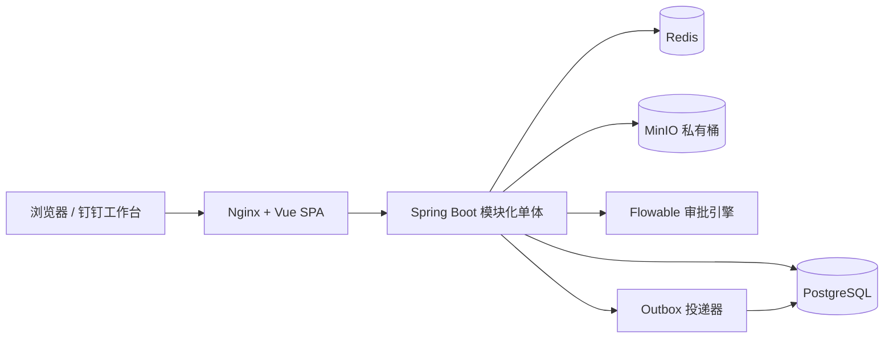

# 律师事务所 OA 项目复盘与下一阶段建议

复盘日期：2026-07-28  
目标规模：100 人以内、低并发、合同与案件文件为主要数据资产

> 更新：本文记录第四阶段结束时的复盘基线。分所成员管理、临时授权、下载限流、
> 安全事件和本地恢复演练已在第五阶段完成；最新结论见
> `DEVELOPMENT_REPORT_2026-07-28_STAGE5.md`。

## 1. 当前结论

系统已经从功能原型进入“可在本地完整验收的模块化单体”阶段。身份、组织、案件、
合同、文档、审批、用印、卷宗和常见 OA 协作模块已形成闭环；本阶段完成办公室级
数据隔离，并保留律师行业必需的跨办公室案件协作。

当前本地运行基线：

- 前端：Vue 3 + TypeScript，端口 `18080`
- 后端：Java 21 + Spring Boot + Flowable，端口 `8081`
- 数据库：PostgreSQL 16，端口 `5433`
- 缓存：Redis 7，端口 `6380`
- 对象存储：MinIO，API/控制台端口 `9000/9001`
- 数据库迁移：Flyway 已成功执行生产迁移 V9；开发种子仍至 V105
- Outbox：当前事件全部为 `PROCESSED`，无待补偿或死信

## 2. 架构与边界

选择模块化单体是适合当前规模的：100 人、低并发不需要微服务带来的网络、部署和
数据一致性成本。业务模块仍按包和表拆分，未来出现独立扩容需求时可从文档处理、
通知或外部集成开始拆分。

## 3. 已形成的业务闭环

| 领域 | 已完成能力 | 核心边界 |
|---|---|---|
| 身份与组织 | 开发演示、钉钉 OAuth 框架、会话、组织快照同步 | 生产禁用开发身份 |
| 客户与冲突 | 主体、别名、客户转换、冲突预检 | 冲突检索保持全所范围 |
| 案件 | 跨境字段、办公室、成员、期限、审批 | 案件成员是访问边界 |
| 合同 | 合同、案件关联、成员、审批 | 合同成员或关联案件权限 |
| 文档 | 私有直传、SHA-256、版本、下载授权 | 不暴露永久公开 URL |
| 审批 | Flowable、待办/已办、转交、催办、状态回写 | 候选角色与办公室范围同时满足 |
| 用印与卷宗 | 用印审批、电子卷宗、卷内编目 | 全程审计 |
| 常见 OA | 公告、任务、请假、报销、会议室、通讯录 | 办公室范围与显式协作并存 |
| 国际化 | 双语品牌、中文/英文门户、12 个办公室 | 业务正文模板仍需继续双语化 |

## 4. 本阶段办公室权限模型

权限被拆成两个正交维度：

1. RBAC 决定用户能否执行发布公告、付款、管理会议室等动作。
2. Office Scope 决定该动作可以作用于哪些办公室的数据。

三类范围：

- 普通成员：只能访问 `user_offices` 中分配的办公室。
- 办公室管理员：只能管理 `access_level=MANAGER` 的办公室。
- 全所管理员/管理合伙人：可跨办公室查询和管理。

例外不是“绕过”，而是显式业务授权：

- 案件成员可访问已加入的跨办公室案件。
- 合同成员、任务负责人/参与人、审批受让人可访问被明确指派的业务。
- 冲突检索保持全所范围，否则不同办公室可能分别接受利益冲突的客户。

## 5. 数据层变化

生产迁移 V8 新增：

- `user_offices.access_level`
- 公告、协作任务、请假、报销、会议室的 `office_id`
- 办公室范围查询索引
- `OFFICE_ADMIN` 角色及对应动作权限
- 会议室唯一键调整为“组织 + 办公室 + 名称”

迁移中的 `office_id` 暂时保留可空，目的是兼容尚未配置办公室的历史组织；所有新建
业务都会由服务层写入办公室。上线迁移前应先跑数据质量 SQL，确认生产历史记录都能
映射到办公室，再在后续迁移中逐步收紧为 `NOT NULL`。

## 6. 当前验证证据

- 后端单元/边界：59/59
- 前端范围策略单元测试：3/3
- 真实依赖 API 冒烟：39/39
- 浏览器：桌面/移动端、中文/英文、16 个业务页面及关键写操作通过
- 前端生产构建：通过
- 浏览器控制台错误：0
- Flyway 正式迁移 V9、开发种子 V105：成功
- Outbox：第五阶段最终验收时 613 条均为 `PROCESSED`

详细清单见 `docs/TEST_MATRIX.md`，覆盖率报告见 `test-results/jacoco/index.html`。

## 7. 仍需正视的风险

### 上线阻断项

1. 尚未使用真实钉钉企业应用验证授权回调、通讯录权限、令牌续期和员工离职停用。
2. 本地数据库和 MinIO 备份恢复已演练；生产 PITR、对象版本恢复和密钥轮换仍待完成。
3. 下载限流和异常行为告警已完成；外发、批量导出与敏感操作二次审批仍待完成。
4. 办公室成员和临时授权后台已完成；授权到期提醒和定期复核仍待完成。

### 工程质量项

1. JaCoCo 行覆盖率仍为 9.24%；API/E2E 覆盖较强，但服务层白盒覆盖不足。
2. 缺少独立 Testcontainers 集成测试，当前 API 验收依赖本地开发数据。
3. 前端多数页面仍是中文业务正文，当前双语主要覆盖登录、导航、标题与办公室页。
4. Flyway 开发环境启用了 out-of-order；正式环境必须保持严格顺序并先演练升级。

## 8. 建议的下一阶段

下一阶段建议命名为“上线准备与法律文档安全强化”，按以下顺序执行：

1. 接入真实钉钉企业应用，在测试组织完成登录、组织同步、离职停用和权限回收验收。
2. 建设办公室成员管理页：加入/调动、主办公室、管理员、临时授权、有效期和审计。
3. 强化文档安全：动态水印、外发审批、下载限流、批量导出审批、异常下载告警。
4. 建立备份恢复演练：PostgreSQL PITR、MinIO 版本恢复、Redis 可丢失边界、密钥轮换。
5. 为 `OfficeAccessService`、`WorkflowService`、`DocumentService`、`MatterService`
   增加 Testcontainers 与并发测试，并对新增代码设置 70% 覆盖门槛。
6. 完成通知模板、流程名称、表单字段和校验提示的业务级中英文覆盖。

在以上阻断项完成前，当前系统适合继续作为本地验收、试点演示和业务流程确认环境；
不建议直接承载真实客户合同与案件原件。
